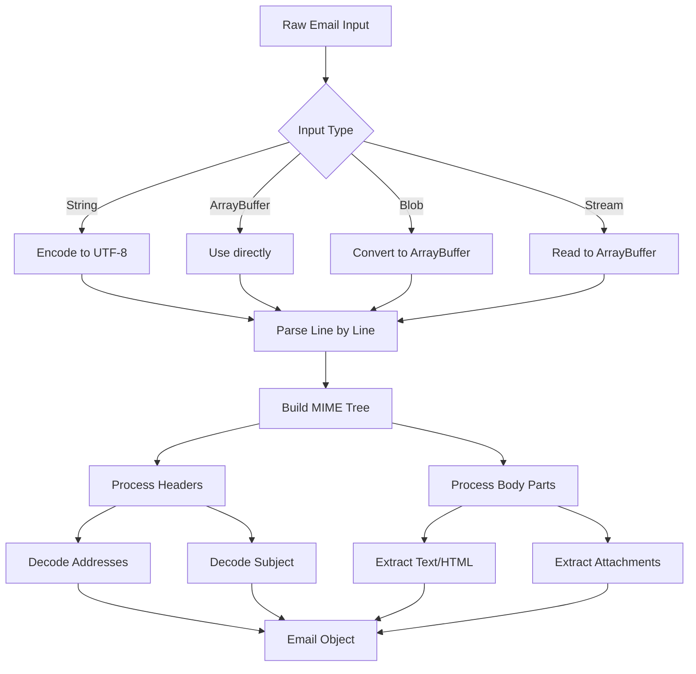

# Parsing Emails

This guide covers the fundamentals of email parsing with postal-mime, including handling different email formats and structures.

## Understanding Email Structure

An RFC822 email consists of headers and a body, separated by a blank line:

```
Header-Name: Header Value
Another-Header: Another Value

This is the email body.
```

## Basic Parsing

### Static Method (Recommended)

The simplest approach uses the static `parse` method:

```javascript
import PostalMime from 'postal-mime';

const email = await PostalMime.parse(rawEmailData);
```

### Instance Method

You can also create an instance for parsing:

```javascript
const parser = new PostalMime();
const email = await parser.parse(rawEmailData);
```

:::caution
Parser instances cannot be reused. Create a new instance for each email you parse.
:::

## Parsing Different Input Types

postal-mime accepts various input formats:

### String Input

```javascript
const rawEmail = `From: sender@example.com
To: recipient@example.com
Subject: Test Email

Hello, World!`;

const email = await PostalMime.parse(rawEmail);
```

### ArrayBuffer / Uint8Array

```javascript
// From file upload or fetch response
const response = await fetch('/path/to/email.eml');
const arrayBuffer = await response.arrayBuffer();
const email = await PostalMime.parse(arrayBuffer);
```

### Blob (Browser)

```javascript
// From file input
const fileInput = document.querySelector('input[type="file"]');
const file = fileInput.files[0];
const email = await PostalMime.parse(file);
```

### Node.js Buffer

```javascript
import { readFile } from 'fs/promises';

const buffer = await readFile('email.eml');
const email = await PostalMime.parse(buffer);
```

### ReadableStream

```javascript
const response = await fetch('/path/to/email.eml');
const email = await PostalMime.parse(response.body);
```

## Working with Headers

### All Headers

Access the complete list of headers:

```javascript
email.headers.forEach(header => {
    console.log(`${header.key}: ${header.value}`);
});
```

### Finding Specific Headers

```javascript
const contentType = email.headers.find(h => h.key === 'content-type');
console.log(contentType?.value);
```

### Custom Headers

X-headers and other custom headers are available:

```javascript
const xMailer = email.headers.find(h => h.key === 'x-mailer');
console.log(xMailer?.value);
```

## Understanding Address Fields

Address fields like `from`, `to`, `cc` return structured objects:

```javascript
// Single address
console.log(email.from);
// { name: "John Doe", address: "john@example.com" }

// Multiple recipients
console.log(email.to);
// [
//   { name: "Alice", address: "alice@example.com" },
//   { name: "Bob", address: "bob@example.com" }
// ]
```

### Address Groups

Email addresses can be grouped:

```javascript
// Parsing "Team: alice@example.com, bob@example.com;"
const addresses = email.to;

addresses.forEach(addr => {
    if (addr.group) {
        console.log(`Group: ${addr.name}`);
        addr.group.forEach(member => {
            console.log(`  - ${member.address}`);
        });
    } else {
        console.log(`Individual: ${addr.address}`);
    }
});
```

## Text and HTML Content

### Multipart/Alternative Handling

When an email has both text and HTML versions, both are available:

```javascript
console.log(email.text); // Plain text version
console.log(email.html); // HTML version
```

### Automatic Conversion

If only one format exists, postal-mime automatically generates the other:

```javascript
// Email with only HTML content
const htmlOnlyEmail = await PostalMime.parse(htmlEmail);
console.log(htmlOnlyEmail.html); // Original HTML
console.log(htmlOnlyEmail.text); // Automatically converted to plain text

// Email with only text content
const textOnlyEmail = await PostalMime.parse(textEmail);
console.log(textOnlyEmail.text); // Original text
console.log(textOnlyEmail.html); // Automatically converted to HTML
```

## Handling Nested Emails

Emails can contain other emails (message/rfc822):

```javascript
// By default, nested emails are parsed and their content is inlined
const email = await PostalMime.parse(forwardedEmail);
console.log(email.text); // Contains content from all nested levels

// To treat nested emails as attachments instead
const email = await PostalMime.parse(forwardedEmail, {
    forceRfc822Attachments: true
});

// Find the nested email attachment
const nestedEmail = email.attachments.find(
    att => att.mimeType === 'message/rfc822'
);

// Parse the nested email separately
const decoder = new TextDecoder();
const nestedContent = decoder.decode(nestedEmail.content);
const nested = await PostalMime.parse(nestedContent);
```

## Character Encoding

postal-mime automatically handles various character encodings:

```javascript
// UTF-8, ISO-8859-1, Windows-1252, etc. are automatically decoded
const email = await PostalMime.parse(emailWithJapaneseContent);
console.log(email.subject); // Correctly decoded Unicode text
```

### MIME Encoded Words

Headers with encoded words (=?charset?encoding?text?=) are automatically decoded:

```javascript
// Raw header: "Subject: =?UTF-8?B?44GT44KT44Gr44Gh44Gv?="
console.log(email.subject); // "こんにちは"
```

## Date Handling

The `date` field is converted to ISO 8601 format when valid:

```javascript
console.log(email.date);
// "2024-01-15T10:30:00.000Z"

// If the date is invalid, the original string is preserved
```

## Error Handling

Handle parsing errors gracefully:

```javascript
try {
    const email = await PostalMime.parse(rawEmail);
} catch (error) {
    if (error.message.includes('nesting depth')) {
        console.error('Email has too many nested parts');
    } else if (error.message.includes('header size')) {
        console.error('Email headers are too large');
    } else {
        console.error('Failed to parse email:', error);
    }
}
```

## Complete Parsing Flow


