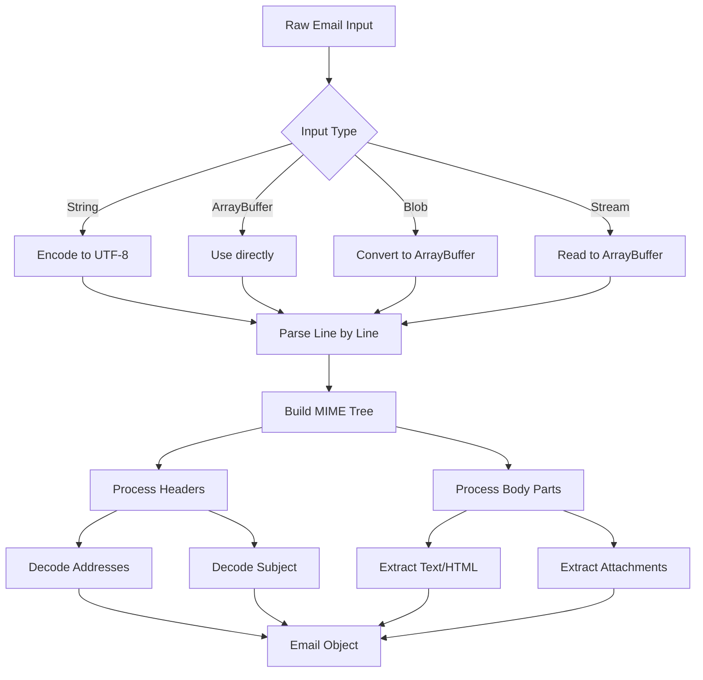

# Parsing Emails


This guide covers the fundamentals of email parsing with postal-mime, including handling different email formats and structures.

## Understanding Email Structure

An RFC822 email consists of headers and a body, separated by a blank line:

```
Header-Name: Header Value
Another-Header: Another Value

This is the email body.
```

## Basic Parsing

### Static Method (Recommended)

The simplest approach uses the static `parse` method:

```javascript
import PostalMime from 'postal-mime';

const email = await PostalMime.parse(rawEmailData);
```

### Instance Method

You can also create an instance for parsing:

```javascript
const parser = new PostalMime();
const email = await parser.parse(rawEmailData);
```

:::caution
Parser instances cannot be reused. Create a new instance for each email you parse.
:::

## Parsing Different Input Types

postal-mime accepts various input formats:

### String Input

```javascript
const rawEmail = `From: sender@example.com
To: recipient@example.com
Subject: Test Email

Hello, World!`;

const email = await PostalMime.parse(rawEmail);
```

### ArrayBuffer / Uint8Array

```javascript
// From file upload or fetch response
const response = await fetch('/path/to/email.eml');
const arrayBuffer = await response.arrayBuffer();
const email = await PostalMime.parse(arrayBuffer);
```

### Blob (Browser)

```javascript
// From file input
const fileInput = document.querySelector('input[type="file"]');
const file = fileInput.files[0];
const email = await PostalMime.parse(file);
```

### Node.js Buffer

```javascript
import { readFile } from 'fs/promises';

const buffer = await readFile('email.eml');
const email = await PostalMime.parse(buffer);
```

### ReadableStream

```javascript
const response = await fetch('/path/to/email.eml');
const email = await PostalMime.parse(response.body);
```

The stream is read to completion before parsing starts, so this is a convenience for stream shaped inputs rather than a way to bound memory: the whole message is held in memory while it is parsed.

```javascript
// Fetch and parse in one step using the stream directly
const response = await fetch('https://example.com/email.eml');
const email = await PostalMime.parse(response.body);

console.log(email.subject);
```

## Working with Headers

### All Headers

Access the complete list of headers:

```javascript
email.headers.forEach(header => {
    console.log(`${header.key}: ${header.value}`);
});
```

### Finding Specific Headers

```javascript
const contentType = email.headers.find(h => h.key === 'content-type');
console.log(contentType?.value);
```

### Custom Headers

X-headers and other custom headers are available:

```javascript
const xMailer = email.headers.find(h => h.key === 'x-mailer');
console.log(xMailer?.value);
```

### Duplicate and Folded Headers

`headers` lists every header in message order, duplicates included. A `value` is unfolded per RFC 5322: the line break of a folded header is removed and the folding whitespace is kept, so `Subject: Hello\r\n    World` reads as `Hello    World`. Encoded words are left as they are; use [`decodeWords()`](../api/decode-words) to decode them. The original lines, folds included, are available in `headerLines`.

Where a header is exposed as a single property, such as `subject`, `from` or `messageId`, the first occurrence wins. The address lists `to`, `cc`, `bcc` and `replyTo` collect every occurrence in message order.

```javascript
// Subject: first
// Subject: second
console.log(email.subject); // "first"
console.log(email.headers.filter(h => h.key === 'subject').length); // 2
```

## Understanding Address Fields

Address fields like `from`, `to`, `cc` return structured objects:

```javascript
// Single address
console.log(email.from);
// { name: "John Doe", address: "john@example.com" }

// Multiple recipients
console.log(email.to);
// [
//   { name: "Alice", address: "alice@example.com" },
//   { name: "Bob", address: "bob@example.com" }
// ]
```

### Address Groups

Email addresses can be grouped:

```javascript
// Parsing "Team: alice@example.com, bob@example.com;"
const addresses = email.to;

addresses.forEach(addr => {
    if (addr.group) {
        console.log(`Group: ${addr.name}`);
        addr.group.forEach(member => {
            console.log(`  - ${member.address}`);
        });
    } else {
        console.log(`Individual: ${addr.address}`);
    }
});
```

## Text and HTML Content

### Format=Flowed Text

postal-mime automatically handles RFC 3676 `format=flowed` text, which is used by some email clients to enable soft line wrapping. Lines ending with a trailing space are "soft" line breaks and get joined with the next line:

```javascript
const rawEmail = `Content-Type: text/plain; charset=utf-8; format=flowed

This is a long paragraph that has been \r
soft-wrapped by the email client into \r
multiple lines.\r
\r
This is a new paragraph.\r
-- \r
My Signature`;

const email = await PostalMime.parse(rawEmail);
console.log(email.text);
// "This is a long paragraph that has been soft-wrapped by the email client into multiple lines.
//
// This is a new paragraph.
// --
// My Signature"
```

Note that the signature separator (`"-- "`) is preserved as a line break even though it ends with a space (per RFC 3676 Section 4.3).

When `delsp=yes` is set in the Content-Type, the trailing space used for folding is removed during unwrapping, allowing languages without word separators (like Japanese) to be soft-wrapped correctly.

### Multipart/Digest Handling

Per RFC 2046, parts inside `multipart/digest` messages default to `message/rfc822` content type instead of `text/plain`. postal-mime handles this automatically:

```javascript
// Digest messages contain multiple forwarded emails
const email = await PostalMime.parse(digestEmail);
// Each part is correctly treated as message/rfc822
```

### Multipart/Alternative Handling

When an email has both text and HTML versions, both are available:

```javascript
console.log(email.text); // Plain text version
console.log(email.html); // HTML version
```

### Content Availability

For single-part emails, only the format present in the message is returned:

```javascript
// Email with only HTML content
const htmlOnlyEmail = await PostalMime.parse(htmlEmail);
console.log(htmlOnlyEmail.html); // Original HTML
console.log(htmlOnlyEmail.text); // undefined

// Email with only text content
const textOnlyEmail = await PostalMime.parse(textEmail);
console.log(textOnlyEmail.text); // Original text
console.log(textOnlyEmail.html); // undefined
```

### Automatic Conversion in Multipart

When a `multipart/mixed` message contains both `text/plain` and `text/html` parts, postal-mime makes both formats available. If one part of the tree only provides one format while other parts provide the other, postal-mime converts the available format to fill in the gap:

```javascript
// multipart/alternative with both formats, both are directly available
const email = await PostalMime.parse(multipartAlternativeEmail);
console.log(email.text); // Plain text version
console.log(email.html); // HTML version

// multipart/mixed with text/plain and text/html parts
// Both types are available, with cross-conversion where needed
const mixedEmail = await PostalMime.parse(multipartMixedEmail);
console.log(mixedEmail.text); // Includes htmlToText() conversion of HTML-only parts
console.log(mixedEmail.html); // Includes textToHtml() conversion of text-only parts
```

## Handling Nested Emails

Emails can contain other emails (message/rfc822):

```javascript
// By default, nested emails are parsed and their content is inlined
const email = await PostalMime.parse(forwardedEmail);
console.log(email.text); // Contains content from all nested levels

// To treat nested emails as attachments instead
const email = await PostalMime.parse(forwardedEmail, {
    forceRfc822Attachments: true
});

// Find the nested email attachment
const nestedEmail = email.attachments.find(
    att => att.mimeType === 'message/rfc822'
);

// Parse the nested email separately. Pass the raw bytes rather than a decoded
// string, so that a nested message in a non UTF-8 charset stays intact
const nested = await PostalMime.parse(nestedEmail.content);
```

Inline parsing is bounded by the `maxRfc822NestingDepth` option (10 levels by default). A message nested deeper than that is returned as an attachment with `rfc822DepthExceeded: true`, and its content is not reflected in `text`, `html` or `attachments`. See [Configuration](../getting-started/configuration#maxrfc822nestingdepth).

## Character Encoding

postal-mime automatically handles various character encodings:

```javascript
// UTF-8, ISO-8859-1, Windows-1252, etc. are automatically decoded
const email = await PostalMime.parse(emailWithJapaneseContent);
console.log(email.subject); // Correctly decoded Unicode text
```

Every charset label of the WHATWG Encoding Standard is supported, plus common aliases seen in mail: `x-` and `cs` prefixes, Windows and IBM code page numbers such as `cp932` or `windows-949`, `iso-8859-8-i`, the Shift_JIS, EUC and ISO-2022-JP families and `tis-620`. A part without a charset is decoded as UTF-8, and a label that cannot be resolved falls back to windows-1252. See [decodeWords()](../api/decode-words#supported-charsets) for the full list.

### MIME Encoded Words

Headers with encoded words (=?charset?encoding?text?=) are automatically decoded:

```javascript
// Raw header: "Subject: =?UTF-8?B?44GT44KT44Gr44Gh44Gv?="
console.log(email.subject); // "こんにちは"
```

## Date Handling

The `date` field is converted to ISO 8601 format when valid:

```javascript
console.log(email.date);
// "2024-01-15T10:30:00.000Z"

// If the date is invalid, the original string is preserved
```

## Error Handling

Handle parsing errors gracefully:

```javascript
try {
    const email = await PostalMime.parse(rawEmail);
} catch (error) {
    if (error instanceof TypeError) {
        console.error('Invalid parser option:', error.message);
    } else if (error.message.includes('nesting depth')) {
        console.error('Email has too many nested parts');
    } else if (error.message.includes('header size')) {
        console.error('Email headers are too large');
    } else {
        console.error('Failed to parse email:', error);
    }
}
```

## Complete Parsing Flow


