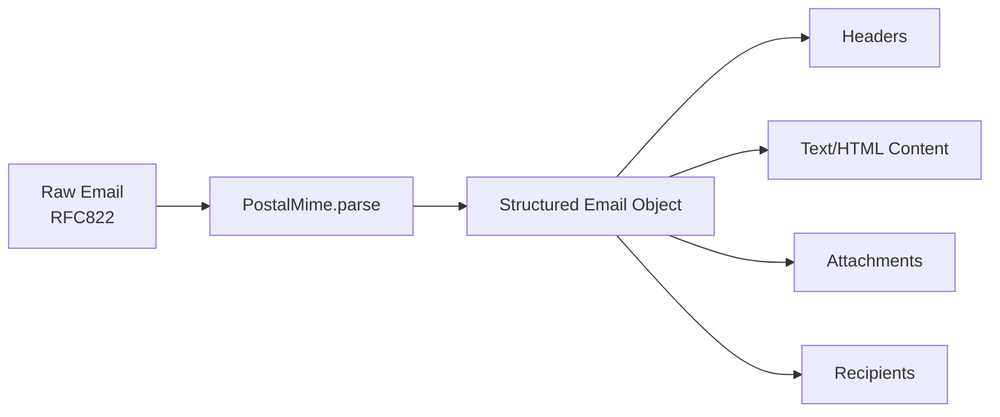

# postal-mime

**postal-mime** is an email parsing library for Node.js, browsers (including Web Workers), and serverless environments (like Cloudflare Email Workers). It takes in a raw email message (RFC822 format) and outputs a structured object containing headers, recipients, attachments, and more.

## Features

- **Zero Dependencies** - No external dependencies, keeping your bundle size minimal
- **Universal Compatibility** - Works in browsers, Web Workers, Node.js, and serverless environments like Cloudflare Workers
- **TypeScript Support** - Fully typed with comprehensive type definitions
- **RFC Compliant** - Follows RFC 2822/5322 email standards
- **Complex MIME Handling** - Supports multipart messages, nested parts, and attachments
- **Security Built-in** - Protection against deeply nested messages and oversized headers

## Quick Example

```javascript
import PostalMime from 'postal-mime';

const email = await PostalMime.parse(`Subject: Hello World
Content-Type: text/html; charset=utf-8

<p>Welcome to postal-mime!</p>`);

console.log(email.subject); // "Hello World"
console.log(email.html);    // "<p>Welcome to postal-mime!</p>"
```

## Installation

```bash
npm install postal-mime
```

## Requirements

- Modern browser with ES6 support, or
- Node.js 14.0+, or
- Cloudflare Workers / Deno / Bun

## How It Works



## Next Steps

- [Installation](./getting-started/installation) - Get postal-mime set up in your project
- [Quick Start Guide](./getting-started/quick-start) - Parse your first email in minutes
- [API Reference](./api/postal-mime) - Detailed API documentation
- [Examples](./examples/basic-parsing) - Real-world usage examples

## Related Projects

postal-mime is developed by the makers of [EmailEngine](https://emailengine.app/) - a self-hosted email gateway that provides a REST API for IMAP and SMTP servers and sends webhooks whenever something changes in registered accounts.
